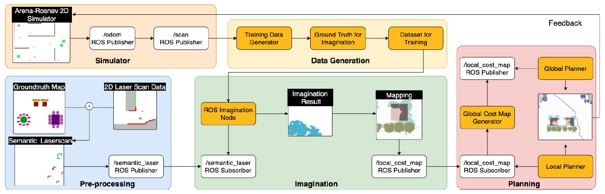

# Imagination-augmented Navigation Based on 2D Laser Sensor Observations

### General information
For more information about the imagination model see also the repository [rosnav-imagination](https://github.com/ignc-research/rosnav-imagination).

Both github projects (this one and [rosnav-imagination](https://github.com/ignc-research/rosnav-imagination)) should be located in the ```src``` folder of the same catkin workspace.

### How to run
Please refer to [Installation.md](docs/Installation.md) for detailed explanations about the installation process.

It works both on Ubuntu 18.04 (with ROS-melodic) and on Ubuntu 20.04 (with ROS-noetic).

1. First make sure that you are working in the ```rosnav``` venv:
```bash
workon rosnav
```
2. For generating the ground truth data for a chosen map:
```bash
roslaunch arena_bringup pedsim_test_gt.launch scenario:=1 gt_extension:=0
```
3. For navigating with an imagination on a predifined path from a json file (the ground truth data should be available for this step):

   3.1. Version 1 (while moving the robot stops to wait for the laser scan data):
   ```bash
   roslaunch arena_bringup pedsim_test.launch scenario:=1 imagination:=yes imagination_size:=100 imagination_model:=3000 imagination_filter1_threshold:=0.2 imagination_filter2_range:=10 json_file:="scenario1.json" user:=m-yordanova workspace:=catkin_ws_ma device:=cpu
   ```
   ```bash
   roslaunch arena_bringup pedsim_test.launch scenario:=1 imagination:=no imagination_size:=100 json_file:="scenario1.json" user:=m-yordanova workspace:=catkin_ws_ma device:=cpu
   ```
   3.2. Version 2 (the robot moves without interruptions because he is directly receiving semantic laser scan data):
   ```bash
   roslaunch arena_bringup semantic_imagination.launch scenario:=1 imagination_size:=100 imagination_model:=3000 imagination_filter1_threshold:=0.2 json_file:="scenario1.json" user:=m-yordanova workspace:=catkin_ws_ma device:=cpu
   ```

*Attention*: Generated files will be stored under ```/home/user/.ros```. After execution there you will find the generated ground truth map, the global imagination map etc. For collecting data refer to the newly generated subfolder ```training```.

The parameter ```imagination``` could be used only with version 1 and could be set to ```yes``` or ```no```. If set to ```no```, no imagination will be used for the navigation, instead paired laser scan and ground truth data will be collected for training. The parameter ```imagination_size``` should be set to ```60 | 80 | 100``` for a ```60x60px | 80x80px | 100x100px``` laser scan data, ground truth data and imagination. The parameter ```imagination_model``` should be set to a valid ```.pth``` file from the [rosnav-imagination](https://github.com/ignc-research/rosnav-imagination) repository (folder ```/example/models/```). Just like the parameter ```json_file``` should be set to an existing ```.json``` file from the folder ```./simulator_setup/training/```.

Different filters are applied on the imagination module. The first one can be set via the parameter ```imagination_filter1_threshold``` to a normalized value between ```0``` and ```1```. The second one can be used only for version 1, setting the parameter ```imagination_filter2_range``` to a pixel value of for example ```10```, corresponding to ```0.5``` meters. Version 2 also uses practically the same filter, but implemented as a 2d Gaussian distribution, which means that no range is needed to be set.

Change the parameters ```user``` and ```workspace``` according to your local system. Set the parameter ```device``` according to your hardware. If you only have a CPU use ```'cpu'```. For a GPU use for example ```'cuda'```.

The parameter ```scenario``` is needed to load the scenario (the compilation of tables and chairs) and to get the number of spawned obstacles through a reference table (see below). This number is needed for the visualization of the type (id) of the obstacles.

| scenario | obstacles_amount |
| -------- | -----------------|
| 1        | 26               |
| 2        | 44               |
| 3        | 35               |
| 4        | 47               |
| 5        | 31               |
| 6        | 31               |
| 7        | 21               |
| 8        | 14               |

If you want you can generate the ground truth image, extending the size of each obstacle with a certain amount of meters. Launch ```pedsim_test_gt.launch``` with the parameter ```gt_extension``` set to the desired extension value such as ```0.1|0.2|0.25``` to have an extension or to ```0``` for no extension.

The map could be changed setting the parameter ```map_file```. Its dimensions, resolution and other parameters will be then automatically read and accordingly used. Check for example the maps ```map_empty``` and ```map_empty_big```.

### Approach / System design

<p align="center">
   
</p>

### Results

#### Version 1

The following videos show both how the imagination is being visualized and how it is considered an occupied area by the local planner, which using the local_costmap changes the robot's path accordingly. Please note that with this version ```teleoperation``` and the rviz feature ```2D Nav Goal``` can not be used properly, since the imagination will be neither visualized nor taken into account by the planners.

|  |  |
|:--:|:--:|
| *Navigation with Imagination* | *Visualization of the Imagination* |

#### Version 2

In the following video on the left you can see how the navigation with imagination works - both with a predifined script with the goals and with the rviz feature ```2D Nav Goal```, where a goal could be directly given to the simulation from the user.

The imagination will show up also when the robot is driven with ```teleoperation``` (see video on the right). Still, since in this case move-base is not used, the robot will drive through the imagination (as it also does through every part of the obstacles). So for this navigation choice, imagination can be used only for visualization purposes.

|  |  |
|:--:| :--:| 
| *Navigation with Imagination* | *Visualization of the Imagination* |

Up until now the imagination was considered only by the additional laser scanner. The following videos show even better navigation after we included the whole imagination area to the local and global costmap, which are used by the local and global planner. The video on the left is done with DWA as a local planner and for the one on the right was used TEB. The global costmap makes the imagination from grey to black and the local costmap is visualized in pink.

|  |  |
|:--:| :--:| 
| *Navigation with updated costmaps and DWA as a local planner* | *Navigation  with updated costmaps and TEB as a local planner* |

### Scripts

1. ```pedsim_test.py```
   * A place for manually creating scenarios (combinations of spawned obstacles).
   * Spawns the chosen scenario.
2. ```show_obstacle_types.py```
   * Shows on top of each obstacle its id (from 1 to 10).
   * Depends on the node ```ground_truth_data```. If not run yet, the unknown obstacles will have an id of 0.
3. ```create_ground_truth_map.py```
   * Creates the semantic ground truth map with or without extending the size of the obstacles.
   * The following nodes depend on this one.
4. ```laser_scan_data.py``` (only for version 1)
   * Collects local laser scan data in form of local_costmaps in the wanted size and updates a global view of it.
   * Expands the observation data with a semantic information, based on the already generated ground truth data.
5. ```move_to_goal.py``` (only for version 1)
   * Moves the robot on a predifined with a json file path.
   * While moving collects pairs of semantic local costmaps and semantic local ground truth data in form of images and npz files ready to be used for training an imagination model.
   * Visualizes a filtered imagination (=imagination_model(local_costmap)).
   * Synchronizes the robot movement with receiving the local_costmap and its corresponding imagination, which could lead to robot waiting for receiving all the data before proceeding.
   * Updates the local costmap with the imagination for the local planner to plan a new path avoiding it.
   * The global costmap receives no imagination, so that there is a costmap with and without an imagination, to be able to distinguish which parts of the currently occupied areas are due to the legs of the obstacles (so because of the laser scan) and which are due to the imagination. This way the imagination module can keep getting only laser scan information without already imaginated areas.
6. ```show_imagination.py``` (only for version 2)
   * Collects semantic laser scan.
   * Visualizes a filtered imagination (=imagination_model(semantic_laser_scan)).
   * Publishes the laser scan with the imagination information on a new topic. So it uses two laser scan topics: one for collecting data for the imagination module (```/scan```) and one for visualizing the borders of the imagination (```/imagination_laser_scan```).
   * Updates the local and global costmap with the imagination for the planners to plan a new path avoiding it.
7. ```move_to_goal_imagination.py``` (only for version 2)
   * Moves the robot on a predifined with a json file path.

### Execution steps

1. Add a scenario
   1. Create a scenario manually (see the substeps below) or create a scenario with the [GUI](https://github.com/ignc-research/arena-tools)
      1. Define a new scenario (combination of spawned obstacles) in the script ```pedsim_test.py``` as a new function (for example ```scenarioX()```).
      2. Add the new scenario option to the scenario calling function in the function ```tables_test()```.
   2. Count the number of obstacles (not obstacle types) in the new scenario and update the reference scenario-obstacles_amount (variable ```scenarioReference```) in the scripts ```create_ground_truth_map.py``` (for version 1) and ```show_obstacle_types.py``` (for version 2).
   3. The used obstacles are described in .yaml files in the folder ```./simulator_setup/static_obstacles/```. If you want to create more obstacles, add additional files.
2. Create the ground truth data: launch ```pedsim_test_gt```
3. Collect training data
   1. Create a path with multiple goals for the robot to drive on. The paths should be created close enough to the obstacles to collect as much information as possible. The robot of course shouldn't behave in a way that is not supposed to later on with the imagination, like for example drive under the tables and chairs. The path can be easily created with the [GUI script PathCreator.py](https://github.com/ignc-research/arena-tools) (with ```map.yaml``` as an input), exported as a ```json``` file and saved under ```./simulator_setup/training```.
   2. Launch ```pedsim_test``` with the ```imagination``` parameter set to ```no``` and the ```json_file``` parameter set to the just created file with the path for the robot to drive on. Set the ```imagination_size``` parameter to the size you want the laser scan and ground truth data pairs to be. The used map can be also changed via the parameter ```map_file```. It will work with every map, no matter what size. There are two ways of dealing with the map.
      1. Load a map without the obstacles (chairs and tables) like for example ```map_empty``` and use the node ```pedsim_test``` for spawning the obstacles on to the map.
      2. Create a ros map from the scenario (combination of spawned obstacles) and directly pass it to the parameter ```map_file```. In this case you do not need the ```pedsim_test``` node anymore, even the ```show_obstacle_types``` node is redundant.
         1. After launching ```pedsim_test_gt``` in the ```/home/user/.ros``` the file ```map_obstacles_legs``` will be generated. This ```png ```image can directly be used as the map image. Now only the files ```map.yaml``` and ```map.world.yaml``` are missing, that are pretty standard to write and contain information about the image such as resolution, origin etc. Take an example from the already available maps in the ```.\simulator_setup\maps\``` folder.
         2. Alternatively ```map_server``` could be used to save the map into a ```pgm``` image.
   3. While the robot is moving, it will collect laser scan data and will generate image pairs of local observation and ground truth data in the folder ```/home/user/.ros/training```. Furthermore two paired npz files with all images will be generated that can be directly used by [rosnav-imagination](https://github.com/ignc-research/rosnav-imagination) repository) to train the model.
4. Train an imagination module (see the [rosnav-imagination](https://github.com/ignc-research/rosnav-imagination) repository)
   1. Upload the generated ```npz``` files to the ```/rosnav-imagination/data/``` folder.
   2. Load both datasets, correct their format and train the model for at least 1000 iterations. Then visualize example outputs of the model to check its correctness.
6. Navigate with imagination (test an imagination module on a test scenario): launch ```pedsim_test.launch``` for version 1 or ```semantic_imagination.launch``` for version 2

### Evaluation runs

#### Parameters

|  Fixed parameters             | Values                                                                |
| ----------------------------- | ----------------------------------------------------------------------|
| laser height                  | 0.2m                                                                  |
| ground truth extension        | 0.25m = 5px                                                           |

|  Variable parameters          | Possible values                                                       |
| ----------------------------- | ----------------------------------------------------------------------|
| scenario                      | "1" / "2" / ... / "8"                                                 |
| json_file                     | "scenario1.json"/"scenario8_eval.json"/"map_center.json"/...          |
| gt_extension                  | "0"/"1"                                                               |
| imagination_model             | "3000_60_normal"/"3000_80_normal"/"3000_100_normal"/"3000_60_ext"/"3000_80_ext"/"3000_100_ext" |
| imagination_size              | "60"/"80"/"100"/"160"                                                 |
| imagination_filter1_threshold | "0.1"/"0.2"/"0.3"/...                                                 |
| imagination_filter2_range     | "5"/"10"/"15"/...                                                     |
| local_planner                 | "dwa"/"teb"                                                           |
| robot_radius                  | 0.3/0.1/0.01/...                                                      |

All of the variable parameters can be set by launching, except for the ``robot_radius``. To change the size, multiple files should be updated:
* ```./simulator_setup/robot/myrobot.model.yaml```
* ```./simulator_setup/robot/thisrobot.urdf.xacro```
* ```./arena-rosnav/arena_bringup/config/config_movebase/costmap_common_params.yaml```
* ```./arena-rosnav/arena_bringup/config/config_movebase/costmap_common_params_sem.yaml```
* ```./arena_navigation/arena_local_planner/model_based/conventional/config/costmap_common_params_burger.yaml```
* ```./arena_navigation/arena_local_planner/model_based/conventional/config/costmap_common_params_burger_sem.yaml```
* ```./arena_navigation/arena_local_planner/model_based/conventional/config/tb3/costmap_common_params_burger.yaml```
* ```./arena_navigation/arena_local_planner/model_based/conventional/config/tb3/costmap_common_params_burger_sem.yaml```
It is similar for parameters such as  ```inflation_radius```, ```cost_scaling_factor``` etc.

#### How to record the data for the evaluation

1. ...

# Multiprocessing branch
This branch is under development to feacilitate multiprocessing and accelerate training and simulation. It works with additional plugins and changes to the flatland repository. If you want to use it, checkout to dev_multi_lei branch in src/forks/flatland folder and pip install -e . inside src/forks/stable-baselines3 folder. 

Afterwards catkin_make inside catkin ws.

Additionally, install nlopt
```
sudo apt-get install ros-melodic-nlopt
```
# Arena-Rosnav

A flexible, high-performance 2D simulator with configurable agents, multiple sensors, and benchmark scenarios for testing robotic navigation. 

Arena-Rosnav uses Flatland as the core simulator and is a modular high-level library for end-to-end experiments in embodied AI -- defining embodied AI tasks (e.g. navigation, obstacle avoidance, behavior cloning), training agents (via imitation or reinforcement learning, or no learning at all using conventional approaches like DWA, TEB or MPC), and benchmarking their performance on the defined tasks using standard metrics.


|  |  |
|:--:| :--:| 
| *Training Stage* | *Deployment Stage* |


## What is this repository for?
Train DRL agents on ROS compatible simulations for autonomous navigation in highly dynamic environments. Flatland-DRL integration is inspired by Ronja Gueldenring's work: [drl_local_planner_ros_stable_baselines](https://github.com/RGring/drl_local_planner_ros_stable_baselines.git). Test state of the art local and global planners in ROS environments both in simulation and on real hardware. Following features are included:

* Setup to train a local planner with reinforcement learning approaches from [stable baselines3](https://github.com/DLR-RM/stable-baselines3.git)

* Training in simulator [Flatland](https://github.com/avidbots/flatland) in train mode

* Local planner has been trained on static and dynamic obstacles with highly dynamic tasks

* Implementation of intermediate planner classes to combine local DRL planner with global map-based planning of ROS Navigation stack

* Integration of other obstacle avoidance approaches in ROS 

* Testing a variety of planners (learning based and model based) within specific scenarios in test mode

* Modular structure for extension of new functionalities and approaches


### Recent Updates

- 26.01.2021: Added Scenario Tasks: generate your own scenario by specifying a scenario.json 


### Documentation & References
* How to use flatland: http://flatland-simulator.readthedocs.io
* ros navigation stack: http://wiki.ros.org/navigation
* pedsim(will be integrated): https://github.com/srl-freiburg/pedsim_ros
* Full documentation and system design is released this week

## 1. Installation
Please refer to [Installation.md](docs/Installation.md) for detailed explanations about the installation process.

## 2. Usage

### DRL Training

Please refer to [DRL-Training.md](docs/DRL-Training.md) for detailed explanations about agent, policy and training setups.

### 2.1 Test the simulation environment and task generator

* In one terminal, start simulation. You can specify the following parameters: 

   * train_mode:=<true, false> 
   * use_viz:=<true, false> (default true)
   * local_planner:=<teb,dwa,mpc,cadrl,arena2d> (default dwa)
   * task_mode:=<random, manual, scenario> (default random)
   * obs_vel:=<float> # maximum velocity of dynamic obstacles [m/s]. It is recommended to set a max velocity within [0.1,0.7] (default 0.3)
   * map

```bash
roslaunch arena_bringup start_arena_flatland.launch train_mode:=false use_viz:=true local_planner:=mpc map_file:=map1 obs_vel:=0.3
```
Now you can click on the generate task button in rviz to generator a new random task (random obstacles and goal is published to /goal). It will automatically navigate to that goal, once you start one of our local planners, which are triggered by a new /goal. If you starte with task_mode "manual" you can specify your goal using the specify Flatland Navigation goal (using normal 2D navigation goal will trigger the move_base planner, thus only works with teb and dwa)

### Run Arena2D models in Rosnav
* start simulation as above, then navigate to the folder arena-rosnav/arena_navigation/arena_local_planner/learning_based/arena_ros/scripts/ and execute arena_node_tb3.py

```
python arena_node_tb3.py
```
### 2.2. [Quick start] start simulation env & plan manager
````
roslaunch arena_bringup start_arena_flatland.launch  train_mode:=false
````
start_flatland.launch will start several other sublaunch files and some neccesary ros packages:
   1. **start simulator node**: start flatland, load robot model
   2. **start map server node**: load map, which will provide occupancy grid used for mapping functions later
   3. **start fake localization**: which will provide static tf map_to_odom, in order to have localization of the robot.
   4. **start task generator node**: which provide task generation service for rviz_plugin(Generate Task)
   5. **start plan manager node**: provide manager for robot state estimation, mapping, global planner and local planner,  which is the key for navigation framework. The move_base is contained, because currently we need its global_planner and mapping functions, later they won't be needed.
   6. **/train_mode/**: 
   * if true, the simulator(flatland) will provide a *step_world service* and the simulator will update its simulation when he receives a *step_world service request*.
   * if true, the plan manager will generate subgoal topic always as goal(global goal) topic.
   * if false, you can also use move_base action triggered by rviz_plugin button *2D Navigation Goal*. 

### 2.3. [Quick start] test DRL training
Export turtlebot model for simulation 

* In one terminnal, export turtlebot model and start simulation

```bash

roslaunch arena_bringup start_arena_flatland.launch  train_mode:=true 	use_viz:=true  task_mode:=random

```
* In another terminal

```
workon rosnav
roscd arena_local_planner_drl
python scripts/training/train_example.py
```
first **activate your python3 env**, which contains libaraies stable_baseline3, geometry2
then python run the script.

Hint: During 2021-01-05 and 2021-01-10, arena_local_planner_drl package is still under the development, which means the api of the class could be drastically changed. Sorry about the inconvinience!

### 2.4. Rviz plugins:
   <p align="center">
      
   </p>

   1. 2D Nav Goal: triggers move_base action
   2. Spawn Model: load a new model.yaml to flatland simulator
   3. Arena Nav Goal: set (global) goal for arena navigation
   4. Generate Task: change task, which changes the position of obstacles and set a new goal for arena navigation


## 3.Design
#### 3.1. Structure of the packges
0. ./forks/flatland:(simulator)
1. arena_bringup: 
   1. config
   2. launch
      1. sublaunch:
         1. flatland_simulator.launch
         2. fake_localization.launch
         3. plan_manager.launch
         4. move_base.launch
         5. task_generator.launch
      2. start_arena_flatland.launch
   3. rviz
2. arena_navigation:
   1. fake_localization 
   2. mapping
   3. global_planner
   4. local_planner
      1. learning_based
      	1.drl
	      2.immitation_learning
	      3.trained-models
      2. model_based
   5. plan_manager
   6. plan_msgs
3. simulator_setup: (saves flatland model files)
   1. maps
   2. obstacles
   3. robot
   4. scripts (e.g. behavior modeling, etc.)
4. task_generator:
5. utils
   1. rviz_plugin
   2. plan_visualization


   
   
   
   
#### 3.2. Navigation framework

<p align="center">
  
</p>

#### **arena_navigation**
   1. **fake_localization**(pkg) 
   2. **mapping**:
      1. costmap2D(pkg) 
      2. Euclean Signed Distancefield Map(pkg) 
      3. Topology Graph(pkg) 
      4. Voxgraph(pkg) 
      5. ...
   3. **global_planner**
      1. arena_global_planner_Dijkstra(pkg) 
      2. arena_global_planner_Astar(pkg) 
      3. arena_global_planner_JPS(Jump point search)(pkg) 
      4. arena_global_planner_KinoAstar(pkg)  
      5. arena_global_planner_Informed_RRTstar(pkg) 
      6. ...
   4. **local_planner**
      1. learning_based
         1. arena_local_planner_drl(pkg) 
         2. arena_local_planner_cardl(pkg)
         3. ... 
      2. model_based
         1. arena_local_planner_TEB(pkg) 
         2. arena_local_planner_VFH*(pkg) 
         3. ...
   5. **plan_manager**(pkg) 
      1. plan_collector
      2. plan_manager
      3. plan_manager_node
   6. **plan_msgs**(pkg) 
      1. msg
         1. RobotState.msg
      2. srv
         1. Subgoal.srv

Plan manager
* plan_manager_node will init a ros node for plan_manager
* plan_manager is implemented as a Finite State Machine
* plan_manager is responsible for state transfer, ros communication and call plan functions from plan_collecor

Plan collector
* plan_collector has no ros communication tasks, plan_collecor only responsible for algorithms
* plan_collector calls libraries from other pkgs(e.g. pkgs in mapping, local planner, global planner) to achieve its functions
* plan_collector also responsible for subgoal generation, which is the job of intermediate planner.

Plan msgs
* saves user-defined msg or srv for arena navigation


#### 3.3. Simulator: Flatland
[Flatland](https://github.com/avidbots/flatland) is a 2D physical simulator based on box2D, which is made to be integratable with ROS and easy to extend functions with its plugin mechanism.

In our project, we have modified and extended the original Flatland source repositary in order to make it better suitable to our DRL planning purpose. The parts that have been modified will be cleared somehow in following sections.

A great introduction to flatland is listed in following website, please checi it out (most importantly in order to know how to create plugin in flatland):
* How to use flatland: http://flatland-simulator.readthedocs.io

Things need to know:
* How flatland updates its simulation progress
* How to write model .yaml files for flatland
* How to create flatland plugins(e.g. laser, driver, motion behavior) which can be added to the model .yaml file


##### How flatland updates its simulation progress
````
flatland_server/src/flatland_server_node.cpp
flatland_server/src/simulation_manager.cpp         (modified by our project)
flatland_server/src/world.cpp
flatland_server/src/timekeeper.cpp
flatland_plugins/src/laser.cpp                     (modified by our project)
````
check out these files, everything relative to simulation update is contained there.
We made some modification in *simulation_manager.cpp*, where we create a */step_world* service server.

##### How to write model .yaml files for flatland
Robot, Obstacles and world can be described by .yaml files, which provide easy setting to users.

check out the model section in http://flatland-simulator.readthedocs.io

##### How to create flatland plugins
Sensors such as laser, actuator such ad diff_driver & other user defined motion behaviors can be coded as a flatland plugin and added to the model .yaml file.

check out the plugin section in http://flatland-simulator.readthedocs.io

````
flatland_plugins/src/laser.cpp                     (modified by our project)
flatland_plugins/src/diff_drive.cpp                (modified by our project)
flatland_plugins/src/model_tf_publisher.cpp        (modified by our project)
flatland_plugins/include/flatland_plugins/tween.h  (for dynamic obstacle motion behavior)
flatland_plugins/include/flatland_plugins/update_timer.h
````
These are the plugins that currently we are using and some of them are modified.

Modification are mostly done in these two functions in each plugins.
These change are made intended to make the publication of topics done in *AfterPhysicsStep* otherthan in *BeforePhysicsStep*.

````
void BeforePhysicsStep(const Timekeeper& timekeeper);
void AfterPhysicsStep(const Timekeeper &timekeeper) ;
````

#### 3.4. Task Generator
To be added...

#### 3.5. Utils
contains rviz_plugins & planning visulizations needed to be showed in rviz.


### 4. DRL Local planner(Training and Testing)
<p align="center">
  
  
</p>

##### Communication:
DRL local planner get the needed observation info by using ROS communication. This may slows down the training, but for current version we just keep it.

DRL local planner get observation info from:
   * flatland server: laser scan
   * plan manager: robot state, subgoal

DRL local planner send action command to flatland server
   * flatland server: diff_drive

##### Observation synchronization
DRL local planner contains observation collector and we designed a synchronization mechanism for following important reasons & aspects:
   1. In real world, each sensor has its own publishing rate and are different from each other
   2. The action calculation should based on the observations that are synchronized, otherwise is useless.
   3. The calculated action is only valid for a specified time horizon(control horizon),e.g. 0.2s. For different control horizon, the action space should be different. 
      1. example 1: action is calculated every 0.01s, time horizon=0.01s, suppose calculated action=1m/s, in this time horizon the robot will actually move 0.01m.
      2. example 2: action is calculated every 0.5s, time horizon=0.5s, suppose calculated action=1m/s, in this time horizon the robot will actually move 0.5m.
      * From 1 & 2, one can see for a same action space, a different time horizon will result in different actual result.


To be added...


#### 4.1 DRL Agent Training

As a fundament for our Deep Reinforcement Learning approaches [StableBaselines3](https://stable-baselines3.readthedocs.io/en/master/index.html) was used. 

##### Features included so far
* Simple handling of the training script through program parameters
* Choose a predefined Deep Neural Network
* Create your own custom Multilayer Perceptron via program parameters
* Networks will get trained, evaluated and saved
* Load your trained agent to continue training
* Optionally log training and evaluation data
* Enable and modify training curriculum


##### Quick Start

* In one terminnal, start simulation

```bash
roslaunch arena_bringup start_arena_flatland.launch train_mode:=true use_viz:=true task_mode:=random
```
* In another terminal

```bash
workon rosnav
roscd arena_local_planner_drl
python scripts/training/train_agent.py --agent MLP_ARENA2D
```


#### 4.1.1 Program Arguments

**Generic program call**:
```
train_agent.py [agent flag] [agent_name | unique_agent_name | custom mlp params] [optional flag] [optional flag] ...
```

| Program call         | Agent Flag (mutually exclusive)  | Usage                                                           |Description                                         |
| -------------------- | -------------------------------- |---------------------------------------------------------------- |--------------------------------------------------- | 
| ``` train_agent.py```|```--agent```                     | *agent_name* ([see below](#training-with-a-predefined-dnn))   | initializes a predefined network from scratch
|                      |```--load ```                     | *unique_agent_name* ([see below](#load-a-dnn-for-training))   | loads agent to the given name
|                      |```--custom-mlp```                | _custom mlp params_ ([see below](#training-with-a-custom-mlp))| initializes custom MLP according to given arguments 

_Custom Multilayer Perceptron_ parameters will only be considered when ```--custom-mlp``` was set!
|  Custom Mlp Flags | Syntax                | Description                                   |
| ----------------  | ----------------------| ----------------------------------------------|
|  ```--body ```    | ```{num}-{num}-...``` |architecture of the shared latent network      |
|  ```--pi```       | ```{num}-{num}-...``` |architecture of the latent policy network      |
|  ```--vf```       | ```{num}-{num}-...``` |architecture of the latent value network       |
|  ```--act_fn ```  | ```{relu, sigmoid or tanh}```|activation function to be applied after each hidden layer |

|  Optional Flags        | Description                                    |
| ---------------------- | -----------------------------------------------|
|  ```--n    {num}```    | timesteps in total to be generated for training|
|  ```--tb```            | enables tensorboard logging                    |
|  ```-log```, ```--eval_log```| enables logging of evaluation episodes   |
|  ```--no-gpu```        | disables training with GPU                     |

#### Examples

##### Training with a predefined DNN

Currently you can choose between 3 different Deep Neural Networks each of which have been object of research projects:

| Agent name    | Inspired by   | 
| ------------- | ------------- | 
| MLP_ARENA2D     | [arena2D](https://github.com/ignc-research/arena2D) | 
| DRL_LOCAL_PLANNER | [drl_local_planner](https://github.com/RGring/drl_local_planner_ros_stable_baselines)  |
| CNN_NAVREP | [NavRep](https://github.com/ethz-asl/navrep) | 

e.g. training with the MLP architecture from arena2D:
```
train_agent.py --agent MLP_ARENA2D
```

##### Load a DNN for training

In order to differentiate between agents with similar architectures but from different runs a unique agent name will be generated when using either ```--agent``` or ```--custom-mlp``` mode (when train from scratch).

The name consists of:
```
[architecture]_[year]_[month]_[day]__[hour]_[minute]
```

To load a specific agent you simply use the flag ```--load```, e.g.:
```
train_agent.py --load MLP_ARENA2D_2021_01_19__03_20
```
**Note**: currently only agents which were trained with PPO given by StableBaselines3 are compatible with the training script. 

##### Training with a custom MLP

Instantiating a MLP architecture with an arbitrary number of layers and neurons for training was made as simple as possible by providing the option of using the ```--custom-mlp``` flag. By typing in the flag additional flags for the architecture of latent layers get accessible ([see above](#411-program-arguments)).

e.g. given following architecture:
```
					   obs
					    |
					  <256>
					    |
					  ReLU
					    |
					  <128>
					    |
					  ReLU
				    /               \
				 <256>             <16>
				   |                 |
				 action            value
```

program must be invoked as follows:
```
train_agent.py --custom-mlp --body 256-128 --pi 256 --vf 16 --act_fn relu
```

#### 4.1.2 Hyperparameters

You can modify the hyperparameters in the upper section of the training script which is located at:
```
/catkin_ws/src/arena-rosnav/arena_navigation/arena_local_planner/learning_based/arena_local_planner_drl/scripts/training/train_agent.py
```

Following hyperparameters can be adapted:
|Parameter|Description|
|-----|-----|
| robot | Robot name to load robot specific .yaml file containing its settings. 
| gamma | Discount factor 
| n_steps | The number of steps to run for each environment per update
| ent_coef | Entropy coefficient for the loss calculation
| learning_rate | The learning rate, it can be a function of the current progress remaining (from 1 to 0)  (i.e. batch size is n_steps * n_env where n_env is number of environment copies running in parallel)
| vf_coef | Value function coefficient for the loss calculation
| max_grad_norm | The maximum value for the gradient clipping
| gae_lambda | Factor for trade-off of bias vs variance for Generalized Advantage Estimator
| batch_size | Minibatch size
| n_epochs | Number of epoch when optimizing the surrogate loss
| clip_range | Clipping parameter, it can be a function of the current progress remaining (from 1 to 0).
| reward_fnc | Number of the reward function (defined in _../rl_agent/utils/reward.py_)
| discrete_action_space | If robot uses discrete action space
| task_mode | Mode tasks will be generated in (custom, random, staged). In custom mode one can place obstacles manually via Rviz. In random mode there's a fixed number of obstacles which are spawned randomly distributed on the map after each episode. In staged mode the training curriculum will be used to spawn obstacles. ([more info](#414-training-curriculum))
| curr_stage | When "staged" training is activated which stage to start the training with.

([more information on PPO implementation of SB3](https://stable-baselines3.readthedocs.io/en/master/modules/ppo.html))

**Note**: For now further parameters like _max_steps_per_episode_ or _goal_radius_ have to be changed inline (where FlatlandEnv gets instantiated). _n_eval_episodes_ which will take place after _eval_freq_ timesteps can be changed also (where EvalCallback gets instantiated).

#### 4.1.3 Reward Functions

The reward functions are defined in
```
../arena_local_planner_drl/rl_agent/utils/reward.py
```
At present one can chose between two reward functions which can be set at the hyperparameter section of the training script:

  
<table>
<tr>
   <th>rule_00</th> <th>rule_01</th>
</tr>
<tr>
   <td>

   | Reward Function at timestep t                                     |  
   | ----------------------------------------------------------------- |   
   |  |
   
   | reward    | description | value |
   | --------- | ----------- | ----- |
   |  | success reward | 
   |  | collision reward | 
   | | danger reward | 
   || progress reward | 
   |  | move reward | 

   </td>
   <td>

   | Reward Function at timestep t                                     |  
   | ----------------------------------------------------------------- |   
   | |
   
   | reward    | description | value |
   | --------- | ----------- | ----- |
   |  | success reward | 
   |  | collision reward |
   |  | danger reward | 
   | | progress reward | =0,\;d^t=d_{ag}^{t-1}-d_{ag}^{t}\\w_{n}*d^t&space;&&space;else\end{cases}\\&space;w_{p}&space;=&space;0.25&space;\quad&space;w_{n}&space;=&space;0.4&space;\quad&space;d_{ag}:agent\:goal&space;\:&space;distance" title="r_{d}^t =\begin{cases}w_{p}*d^t & d^t>=0,\;d^t=d_{ag}^{t-1}-d_{ag}^{t}\\w_{n}*d^t & else\end{cases}\\ w_{p} = 0.25 \quad w_{n} = 0.4 \quad d_{ag}:agent\:goal \: distance" />(*)
   | | move reward | 

   *_higher weight applied if robot drives away from goal (to avoid driving unneccessary circles)_
   </td>
</tr>
</table>


#### 4.1.4 Training Curriculum

For the purpose of speeding up the training an exemplary training currucilum was implemented. But what exactly is a training curriculum you may ask. We basically divide the training process in difficulty levels, here the so called _stages_, in which the agent will meet an arbitrary number of obstacles depending on its learning progress. Different metrics can be taken into consideration to measure an agents performance.

In our implementation a reward threshold or a certain percentage of successful episodes must be reached to trigger the next stage. The statistics of each evaluation run is calculated and considered. Moreover when a new best mean reward was reached the model will be saved automatically.

Exemplary training curriculum:
| Stage           | Static Obstacles | Dynamic Obstacles  |
| :-------------: | :--------------: | ------------------ |
| 1               |  0               | 0                  |
| 2               |  10              | 0                  |
| 3               |  20              | 0                  |
| 4               |  0               | 10                 |
| 5               |  10              | 10                 |
| 6               |  13              | 13                 |

#### 4.1.5 Important Directories

|Path|Description|
|-----|-----|
|```../arena_local_planner_drl/agents```| models and associated hyperparameters.json will be saved to and loaded from here ([uniquely named directory](#load-a-dnn-for-training)) 
|```../arena_local_planner_drl/configs```| yaml files containing robots action spaces and the training curriculum
|```../arena_local_planner_drl/training_logs```| tensorboard logs and evaluation logs
|```../arena_local_planner_drl/scripts```| python file containing the predefined DNN architectures and the training script
